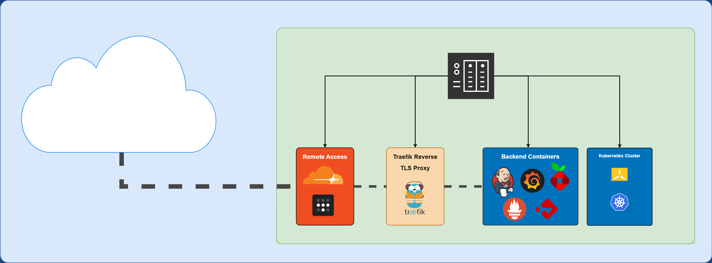

# About my Homelab Setup



# Services I use in my Lab:

Services that I bring up using Docker Compose

| Service Name | Description |
|--------------|-------------|
| traefik | Reverse proxy/load balancer with Let's Encrypt for TLS Certs|
| tailscale | VPN for remote access to my homelab |
| portainer | Docker/Kubernetes Management Platform/UI |
| pihole | DNS server and ad-blocker |
| passbolt | Self Hosted Password/Secrets Manager |
| db | MariaDB for Passbolt password manager |
| jenkins | Continuous integration and delivery (CI/CD) server |
| prometheus | Monitoring and alerting system (How I scrape metrics) |
| grafana | Data visualization and analytics platform (Dashboards) |
| cloudflare-tunnel | Cloudflare tunnel for secure access to some applications |


# Bring up all services

1. Create a `.env` file based on the `.env_template` file.

```
cp env_template .env
```

2. Modify the values of each environment variable to whats suitable for your environment.

```
vi .env
```

3. Bring up all services with docker-compose up

```
docker-compose up -d
```

Got errors? Troubleshoot based on the error messages! This is a complex setup, likely it is better for you to start from scratch, and copy/paste components of my setup into your own setup.  I suggest bringing up one service at a time, then adding on things like Traefik.